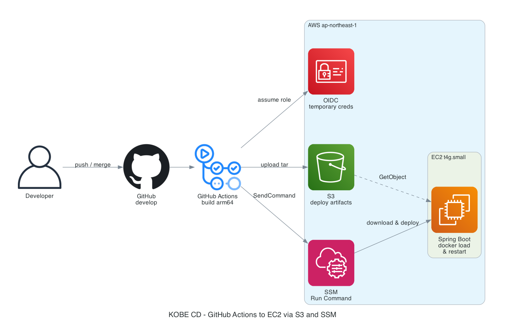

# CD 構成（S3 + SSM）

> 図: [`cd_s3_ssm.png`](./cd_s3_ssm.png)  
> workflow: [`.github/workflows/deploy.yml`](../../.github/workflows/deploy.yml)

SSH（22番）をインターネットに開けず、GitHub Actions から EC2 へデプロイするための構成です。

## 全体像



```text
開発者 push → GitHub (develop)
                 → GitHub Actions（arm64 ビルド）
                      │
                      ├─ OIDC で AWS 一時認証
                      ├─ イメージ tar を S3 へ upload
                      └─ SSM Run Command で EC2 に命令
                              │
                              ▼
                     EC2 が S3 から取得 → docker load → 再起動
                              │
                              ▼
                     Health check（HTTP :9090）
```

## なぜこの構成か

| 方式 | 内容 |
| --- | --- |
| SSH + SG で Actions IP を許可 | 可能だが、Actions の出口 IP が多数・変動する |
| SSH を `0.0.0.0/0` | 入口を世界に晒すため非推奨 |
| **S3 + SSM（採用）** | 22番不要。OIDC の一時権限。pem を GitHub に置かない |

SSH 自体は鍵つきの安全な通信だが、今回の課題は「**誰が 22番に届けるか**」。  
CD のために入口を広げず、AWS API（SSM）経由でデプロイする。

## 主な AWS リソース

| リソース | 名前 / 値 |
| --- | --- |
| S3 | `kobe-backend-deploy-515966496540` |
| IAM Role（Actions） | `kobe-backend-github-actions-deploy`（OIDC） |
| IAM Role（EC2） | `kobe-backend-ec2-role` + `AmazonSSMManagedInstanceCore` |
| EC2 | `i-0d0c06a6ced085c4d`（`t4g.small` / arm64） |
| Elastic IP | `18.181.34.28` |

## GitHub 側で必要なもの

- **OIDC 用:** workflow の `permissions: id-token: write`（実装済み）
- **不要:** `EC2_SSH_KEY` / `EC2_SSH_USER`（SSH しないため）

## 図の再生成

```bash
# リポジトリルートで（diagrams + graphviz が必要）
python docs/infrastructure/generate_cd_s3_ssm.py
```
